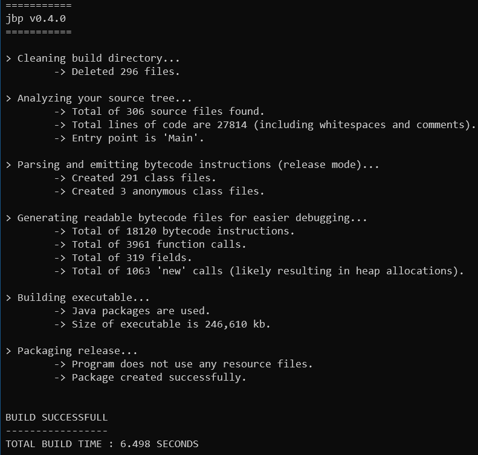

# jbp

**(NOTE: This program is still alpha software, so it might break for stupid reasons.)**

jbp (just build please) is as the name suggests a build tool. It is designed to
compile java projects in an easy way that just works.

When working with Java you are usally forced to use a build tool because
just using 'javac' (especially with dependencies) is very inconvenient. However, most of those build tools are
as I find very complex and take a lot of configuration work.

I just wanted a way to say 'build my project' and get an executable jar without any setup.
That is why I created this program. It is a single .java file which acts as a wrapper around
around the tools inside your JDK (javac, javap, javadoc and jar).

What I also wanted is some additional information about my project especially regarding the emitted bytecode.
That is why this tool will generate .bytecode files which can immediately be read by just opening them in a
text editor.

This program has been build with OpenJDK 11 and has been tested only on Windows 10.

## How to use

Simply copy the jbp.class file into your project root directory. Then you can call:
```
java jbp
```

That is all. After that your project will build.


If you want to run/test your program, a nice way is to execute the following command sequence:
```
pushd build\release && java -jar Program.jar && popd
```

If you wish to compile with libraries, simply add a 'libs' directory in your root folder and put
all your libraries in there.
If you have other resource files (like images or config files) simply create a 'res' directory.

'jbp' will always clean the build directory and will NOT do any incremental build. The reason for that is that I have been
screwed many times by incremental builds in the past where I was not running the most recent version.
Therefore this tool will make a fresh build from scratch everytime so you can be sure there isn't any garbage left from
the previous build.

If you want to change the build configuration you can create a jbp.config file in your project root directory
and change them in there.

Example jbp.config (which represents the default build config):
```
ProgramName = Program.jar
EntryPoint = ---
Mode = debug
Encoding = UTF-8
Documentation = No
ByteCodeDetails = Yes
RunAfterBuild = No
SimpleOutput = No
Log = No
Compiler = ---
Bytecodeviewer = ---
JVM = ---
```

| Entry | Default | Description |
| --- | --- | --- |
| ProgramName | Program.jar | The name you wish your executable jar should have. |
| EntryPoint | --- | Class name containing your main method. The default value means you wish 'jbp' to find the entry out for you. |
| Mode | debug | Whether you wish to include debug symbols in your release (debug) or not (release). |
| Encoding | UTF-8 | The encoding used when you compile. |
| Documentation | No | Whether you wish to generate javadoc. |
| ByteCodeDetails | Yes | Generate human readable bytecode files and print simple stats about them. |
| RunAfterBuild | No | Run your project after successful build. Note that it will be ran with assertions enabled. |
| SimpleOutput | No | If set to 'Yes' only print whether build was successful or not (including errors in that case). |
| Log | No | Writes to a jbp.log file build information. |
| Compiler | --- | The path of the compiler executable you wish to use. Default value means the global one will be used. |
| Bytecodeviewer | --- | The path of the javap executable you wish to use. Default value means the global one will be used.  |
| JVM | --- | The path of your java executable you wish to use. Default value means the global one will be used. |

When you build time is becoming too slow, I recommend that you turn off 'ByteCodeDetails' and enable 'SimpleOutput'. Also if you know your main class (entry point) it will
lead to a better build time by specifying it. Another thing you can do is set 'Mode' to 'release' this should decrease build time aswell since debug information is omitted.
Finally you can create a .bat file (e.g build.bat) to fiddle around with JVM arguments to further speed up the build process.
Example:
```
@echo off
java -XX:CICompilerCount=1 -XX:TieredStopAtLevel=1 -XX:+TieredCompilation -XX:+UseSerialGC -Xmx64m jbp
```

## License

This software is licensed under the terms of MIT license.
For details, please read the LICENSE file.
