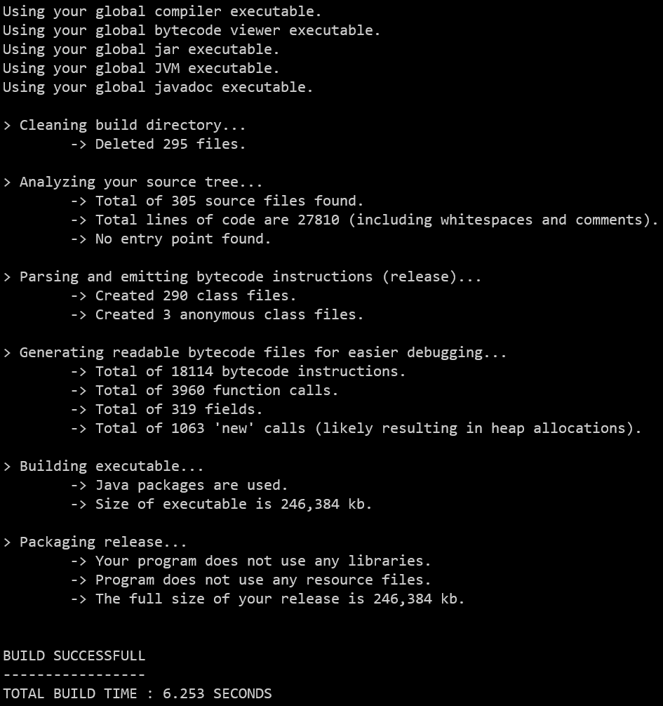

# jbp

jbp (just build please) is as the name suggests a build tool. It is designed to
compile java projects in an easy way that just works.

When working with Java you are usally forced to use a build tool because
just using 'javac' (especially with dependencies) is very inconvenient. However, most of those build tools are
as I find very complex and take a lot of configuration work.

I just wanted a way to say 'build my project' and get an executable jar without any setup.
That is why I created this program. It is a single .java file which acts as a wrapper around
around the tools inside your JDK (javac, javap and jar).

What I also wanted is some additional information about my project especially regarding the emitted bytecode.
That is why this tool will generate .bytecode files which can immediately be read by just opening them in a
text editor.

This program has been build with OpenJDK 11 and has been tested only on Windows 10.

## How to use

Simply copy the jbp.class file into your project root directory. Then you can call:
```
java jbp
```

That is all. After that your project will build.



To be a bit more precise it will do the following things for you:

1. Create a build directory (or clean already existing one)
2. Compile all the .java files inside the 'src' directory (build/classes)
3. Calls 'javap' to generate readable bytecode files for easier debugging (build/bytecode)
4. Builds the executable (.jar) (build/release)

When you have dependecies you just need to create a 'libs' directory inside your project root folder.
'jbp' will add them to the classpath and move them into the 'build/release' directory so your .jar will
find it when being executed.

'jbp' will always clean the build directory and will NOT do any incremental build. The reason for that is that I have been
screwed many times by incremental builds in the past where I was not running the most recent version.
Therefore this tool will make a fresh build from scratch everytime so you can be sure there isn't any garbage left from
the previous build.

**(NOTE: This program is still alpha software, so it might break for stupid reasons.)**

## License

This software is licensed under the terms of MIT license.
For details, please read the LICENSE file.
